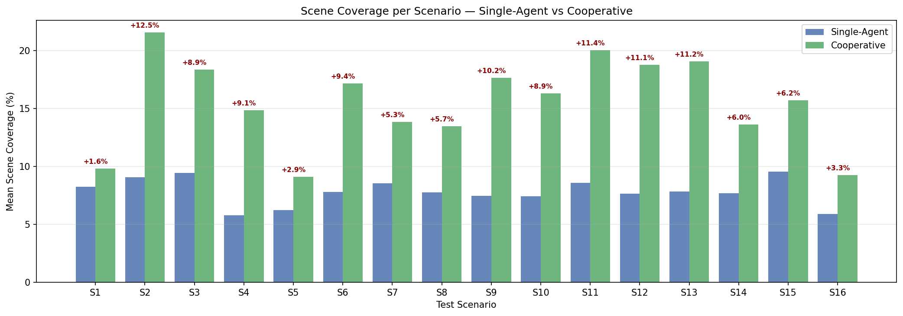
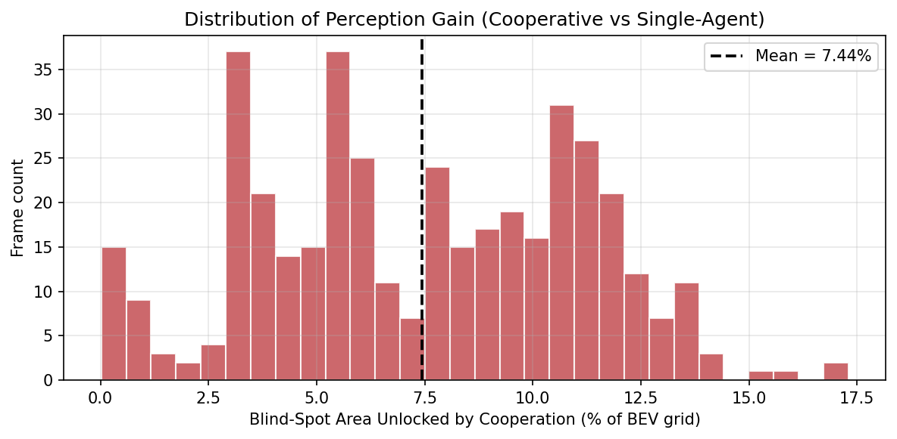
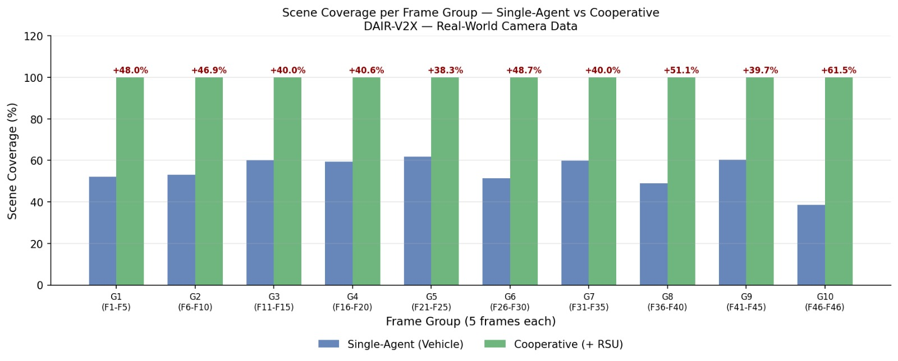
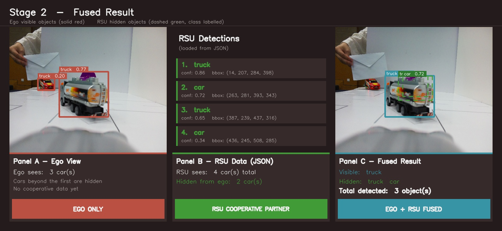
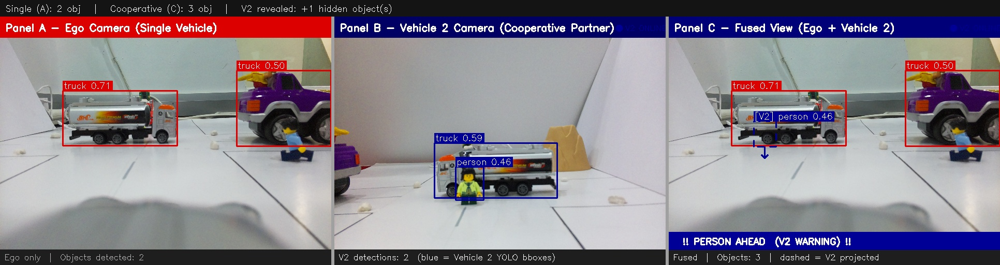
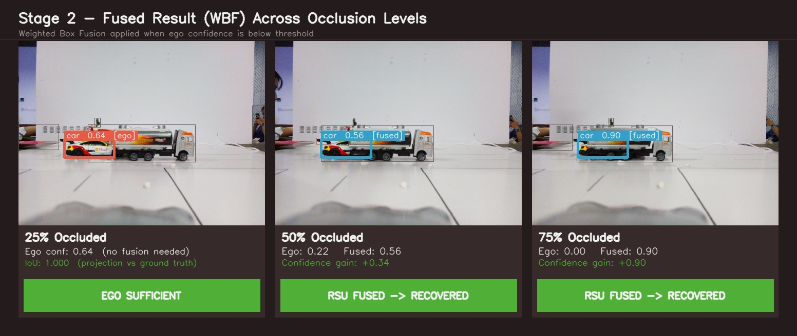
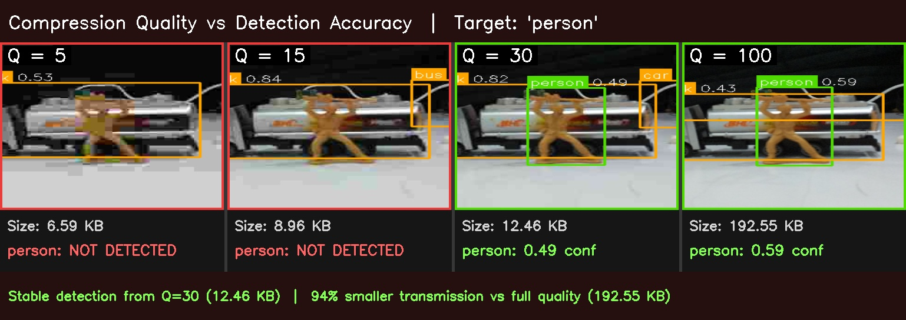
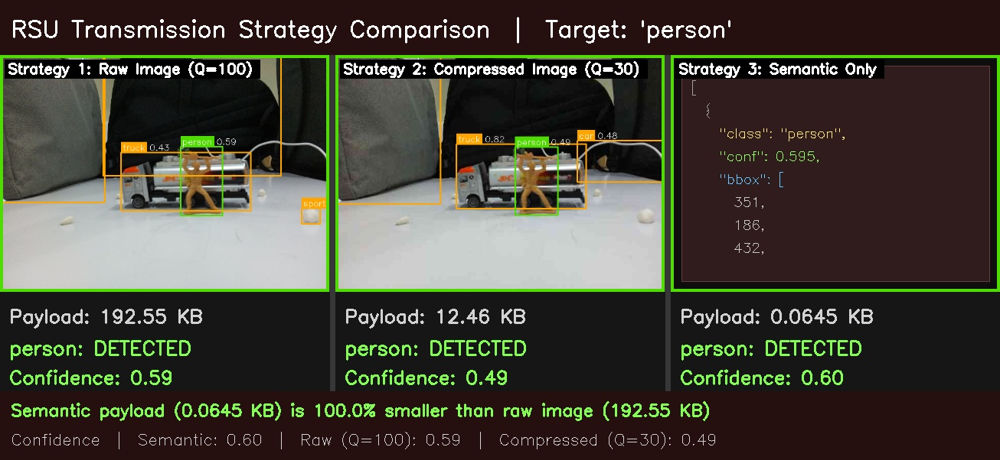
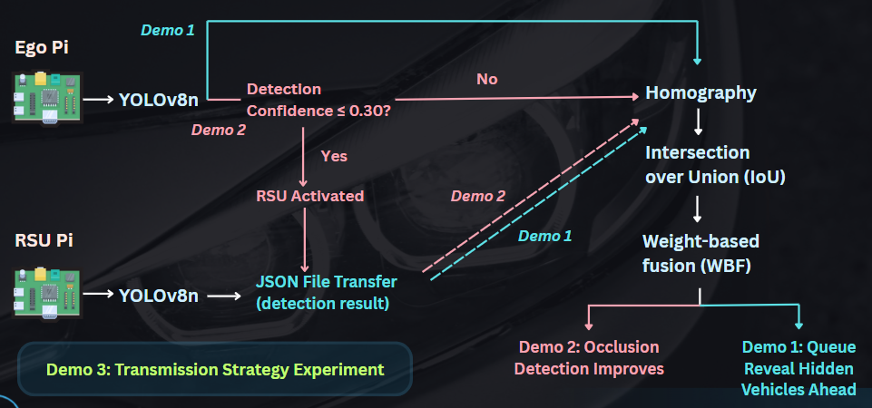

# Smart V2X Cooperative Perception in Autonomous Vehicles
### Optimizing Cooperative Perception in Autonomous Vehicles through Semantic Data Analytics
 
**Monash University FIT3162/FIT3164 Final Year Project**
 
| | |
|---|---|
| **Team** | Goh Jia Xuan, Ooi Pei Shuen, Ng Li Xian |
| **Supervisor** | Dr. Tan Chee Keong |
| **Final Report** | [FIT3164_Final_Written_Report.pdf](./docs/FIT3164_Final_Written_Report.pdf) |
| **Final Presentation** | [Final Presentation Slides](https://canva.link/a1vu3ba7bnp9td4) |
| **Project Poster** | [Project Poster](./docs/MDS17.pptx.pdf) |
---
 
## Overview
 
A vehicle cannot detect what it cannot see. Physical occlusion caused by
large vehicles, buildings, and road geometry creates blind spots that no
single onboard sensor can resolve alone. This project addresses that
limitation through **cooperative perception** — an ego vehicle requests and
fuses detection data from a Road Side Unit (RSU) via Vehicle-to-Everything
(V2X) communication, activating assistance only when needed and minimising
bandwidth by transmitting detection results rather than raw images.
 
The system is validated through two independent strands of work:
 
1. **Dataset Analysis** (`stat_analysis/CoopPerception/`) — statistical proof that
   cooperative perception improves scene coverage, using OPV2V (simulated
   LiDAR) and DAIR-V2X (real-world camera) benchmark datasets
2. **Hardware Prototype** (`final_demo/`) — a physical two-node Raspberry Pi
   system demonstrating cooperative perception, confidence-triggered RSU
   activation, and transmission optimisation on real camera hardware
---
 
## Repository Structure
---
 
## Key Results
 
### Dataset Validation
 
| Dataset | Single-Agent | Cooperative | Gain | Statistical Test |
|---|---|---|---|---|
| **OPV2V** (simulated LiDAR, 407 frames, 16 scenarios) | 7.77% ± 1.38% | 15.22% ± 4.33% | **+7.44%** | Paired t-test p = 9.67×10⁻¹⁴⁵, Cohen's d = 2.011 |
| **DAIR-V2X** (real-world camera, 46 pairs) | 55.9% ± 13.5% | 100% (ground truth) | **+44.1%** | Descriptive (see [methodology note](./CoopPerception/README.md#why-dair-v2x-is-descriptive)) |
 

### Hardware Prototype 
 
| Experiment | Ego Only | Cooperative | Key Finding |
|---|---|---|---|
| **Demo 1 — Queue Perception** | Unknown vehicles beyond first | 3 vehicles detected | RSU reveals full queue ahead for overtake decisions |
| **Demo 2 — Occlusion Detection** | Person not detected | Person detected (conf 0.46), warning triggered | RSU recovers safety-critical detection behind truck |
| **Confidence-Triggered Cooperative Perception (R4)** | 0.00 conf at 75% occlusion | 0.88 conf (fused) | Confidence-trigger fires correctly at all 3 occlusion levels, no false activations |
| **Transmission Strategy (R5)** | Raw image: 192.55 KB | Semantic JSON: 0.0645 KB | **99.9% payload reduction**, detection preserved (conf 0.60) |
 

---
 
## System Architecture 

---
 
## Assumptions

- Ego and RSU are connected on the same Wi-Fi network (mobile hotspot)
- Ground plane is approximately flat 
- A shared anchor vehicle (truck/car/bus) is visible in both ego and RSU camera frames simultaneously
- Camera positions remain static during each capture session
- YOLOv8n COCO-pretrained weights generalise sufficiently to toy-scale objects without fine-tuning
- RSU detection JSON is trusted — no validation of RSU data integrity is performed

## Constraints
 
- Hardware limited to Raspberry Pi 4 Model B (4GB RAM) — restricts model choice to YOLOv8n; larger variants (YOLOv8s/m) exceed on-device inference capacity
- No GPS or pre-calibrated camera poses available — homography computed from shared anchor vehicle instead
- UDP/network packet size practically limits raw image transmission at higher resolutions
- Physical test environment limited to tabletop scale with toy vehicles as proxies for real road objects

## Out of Scope
 
- End-to-end latency benchmarking and real-time delay thresholds
- Live video streaming between Pi nodes (static pre-captured frames used instead)
- Multi-RSU coordination (single RSU only)
- Real road or outdoor deployment
- V2X security and privacy mechanisms
- Model fine-tuning or retraining on domain-specific data

---

## Known Limitations
 
| Limitation | Impact | Suggested Improvement |
|---|---|---|
| Toy-scale tabletop environment | Confidence thresholds and detection values not transferable to real-world conditions | Test with larger-scale proxies under varied lighting |
| Single RSU node only | Does not represent realistic multi-RSU network topology | Multi-RSU coordination with conflict resolution logic |
| Fixed confidence threshold (0.30) | Not adaptive to lighting, scale, or environment changes | Per-scene adaptive threshold calibrated dynamically |
| Static pre-captured frames | No real-time performance characterisation; Demo 1 provides object count/class only — no distance or speed | Live video streaming with end-to-end latency benchmarking |
 
---

## Tech Stack
 
| Category | Tools |
|---|---|
| Languages | Python 3.10 (dataset analysis), Python 3.11 (hardware, Raspberry Pi OS Bookworm) |
| Detection | YOLOv8n (Ultralytics) |
| Fusion | Weighted Box Fusion (`ensemble-boxes`) |
| Computer Vision | OpenCV (homography, image I/O), Open3D (PCD reading) |
| Data Science | NumPy, SciPy (paired t-test, Wilcoxon, Cohen's d), Matplotlib, PyYAML |
| Hardware | 2× Raspberry Pi 4 Model B, 2× Pi Camera Module v2, mobile hotspot |
| Dev Tools | VS Code (Remote-SSH), SSH/SCP |
 